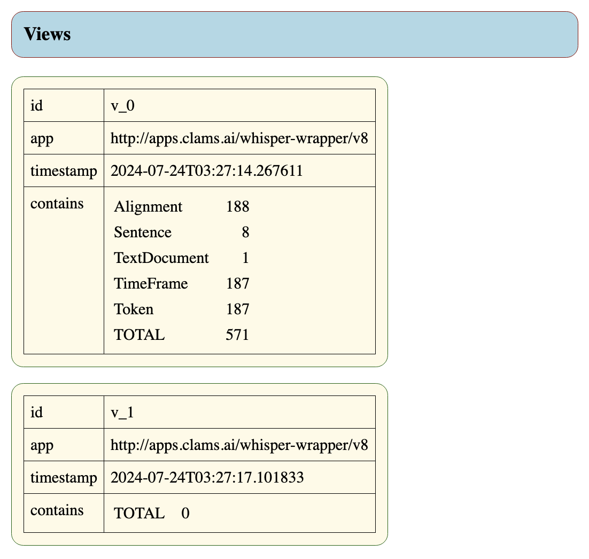
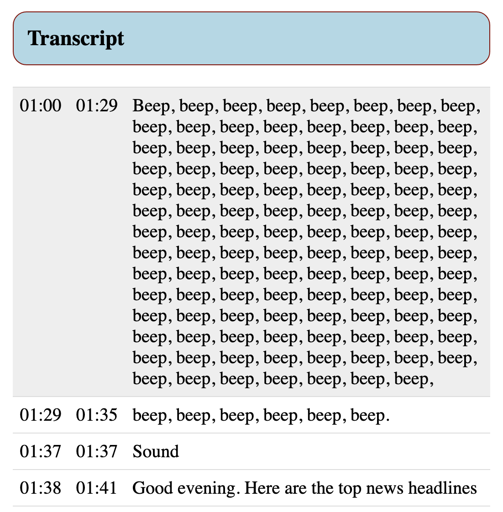
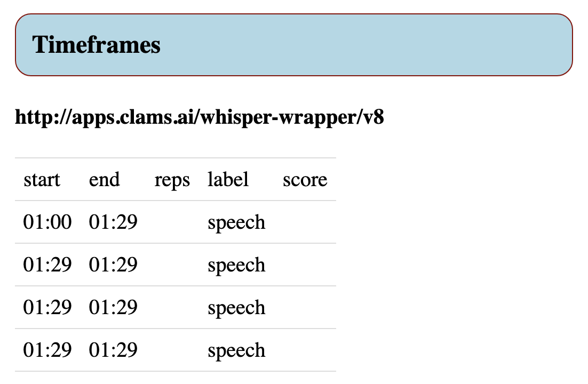

# Summarizer output description

Both for the JSON file and the web page.


### Summary example

Here is a fragment of the summary of a MMIF file, one that was created with the CLAMS Whisper app version v8 (see [https://apps.clams.ai/whisper-wrapper/v8/](https://apps.clams.ai/whisper-wrapper/v8/) which has a transcript and time frames.

```json
{
  "mmif_version": "http://mmif.clams.ai/1.0.5",
  "documents": [
    {
      "id": "d1",
      "type": "VideoDocument",
      "location": "baapb://cpb-aacip-507-154dn40c26.video"
    }
  ],
  "views": [
    {
      "id": "v_0",
      "app": "http://apps.clams.ai/whisper-wrapper/v8",
      "timestamp": "2024-07-24T03:27:14.267611",
      "annotations": 571,
      "annotation_types": {
        "TextDocument": 1,
        "Alignment": 188,
        "Token": 187,
        "TimeFrame": 187,
        "Sentence": 8
      }
    },
    {
      "id": "v_1",
      "app": "http://apps.clams.ai/whisper-wrapper/v8",
      "timestamp": "2024-07-24T03:27:17.101833",
      "annotations": 0,
      "annotation_types": {}
    }
  ],
  "transcript": [
    {
      "start-time": 60000,
      "end-time": 89980,
      "text": "Beep, beep, beep, beep, beep, beep, beep, beep, beep, beep, beep, beep, beep, beep, beep, beep, beep, beep, beep, beep, beep, beep, beep, beep, beep, beep, beep, beep, beep, beep, beep, beep, beep, beep, beep, beep, beep, beep, beep, beep, beep, beep, beep, beep, beep, beep, beep, beep, beep, beep, beep, beep, beep, beep, beep, beep, beep, beep, beep, beep, beep, beep, beep, beep, beep, beep, beep, beep, beep, beep, beep, beep, beep, beep, beep, beep, beep, beep, beep, beep, beep, beep, beep, beep, beep, beep, beep, beep, beep, beep, beep, beep, beep, beep, beep, beep, beep, beep, beep, beep, beep, beep, beep, beep, beep, beep, beep, beep, beep, beep, beep,",
      "id": "v_0:se_1"
    },
    {
      "start-time": 89980,
      "end-time": 95600,
      "text": "beep, beep, beep, beep, beep, beep.",
      "id": "v_0:se_2"
    },
    {
      "start-time": 97140,
      "end-time": 97820,
      "text": "Sound",
      "id": "v_0:se_3"
    },
    {
      "start-time": 98539,
      "end-time": 101060,
      "text": "Good evening. Here are the top news headlines",
      "id": "v_0:se_4"
    },
  ],
  "captions": [],
  "timeframes": {
    "http://apps.clams.ai/whisper-wrapper/v8": [
      {
        "identifier": "v_0:tf_1",
        "label": "speech",
        "score": null,
        "start-time": 60000,
        "end-time": 89980,
        "representatives": []
      },
      {
        "identifier": "v_0:tf_2",
        "label": "speech",
        "score": null,
        "start-time": 89980,
        "end-time": 89980,
        "representatives": []
      },
      {
        "identifier": "v_0:tf_3",
        "label": "speech",
        "score": null,
        "start-time": 89980,
        "end-time": 89980,
        "representatives": []
      },
      {
        "identifier": "v_0:tf_4",
        "label": "speech",
        "score": null,
        "start-time": 89980,
        "end-time": 89980,
        "representatives": []
      }
    ]
  }
}
```

One of the perks of the summary is that errors in the MMIF file will be more obvious. For example, in the case above it quite clear that something went wrong with the start end end times of the time frames (an error that also happens to be present in the MMIF output).


### Webpage example

The website generated from the above summary is has an index file and files for the views, transcript, captions and time frames. Again, you can see that something was amiss with the tiem frames.

The views:



The transcript:



The time frames:


