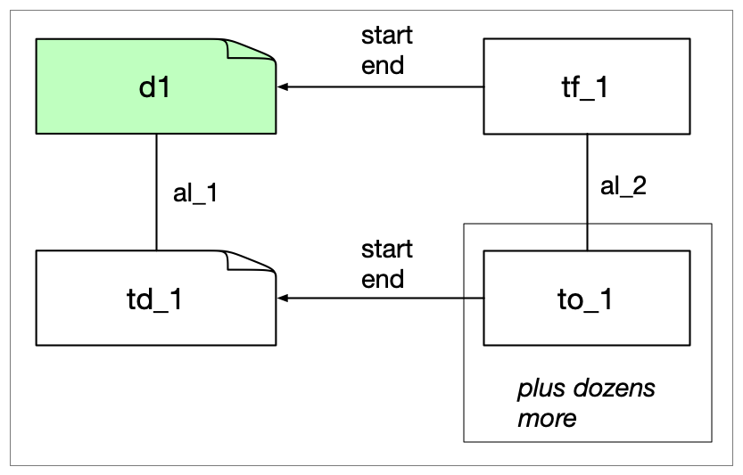

[ [developer notes](../developer-notes.md)
| [whisper](whisper.md)
| kaldi
| [SWT-DocTR](swt-doctr.md)
| [SWT-Llava](swt-llava.md)
| [spaCy](spacy.md)
]

## Kaldi pipeline

For aapb-pua-kaldi-wrapper/0.2.2 and aapb-pua-kaldi-wrapper/0.2.3.

Note that these are not the same as the pipeline mentioned int the [developer notes](../developer-notes.md). This is of limited concern sice Kaldi is pretty much out of the loop now.

Another thing to note is that these pipelines ran in MMIF version 0.4.0, and when you try to run this in the current version 1.0.5 it does not end well. Another reason to ignore this for now. This is probably different for aapb-pua-kaldi-wrapper/v3. So this section is not complete till we have looked at that version.

0.2.2: checked with a shortened file of unknown provenance.<br/>
0.2.3: checked with cpb-aacip-507-028pc2tq55.

The first file has one view with 1 TextDocument, 187 Tokens, 187 TimeFrames and 188 Alignments. The TextDocument is aligned to the VideoDocument and the Tokens are aligned with TimeFrames. These is all pretty much the same as with [Whisper](whisper.md) except that there are no Sentence type annotations. Another difference with WHisper is that these files do not have any punctuation. The second file has the same structure.

The graph is also very similar to the graph for Whisper:



Since there is no punctuation and no Sentence types, the summarizer output has everything end up in one transcript element. We could either introduce punctuation or use a semi-random way of using time signatures of tokens to create sentence-like objects. However, we are leaning towards never having the summarizer add information to the CLAMS output. 


### Output

For the summary we get all the Sentences with their start and end times and the text. Since there was no Sentence object in the MMIF file there is no identifier for the transcript segments.

```json
{
  "start-time": 99540,
  "end-time": 103840,
  "text": "Here are the top news headlines today. Moscow threatened to deploy anti"
}
```

The fact that this segment starts at the beginning of a sentence is a coincident.