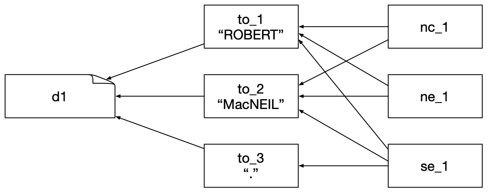
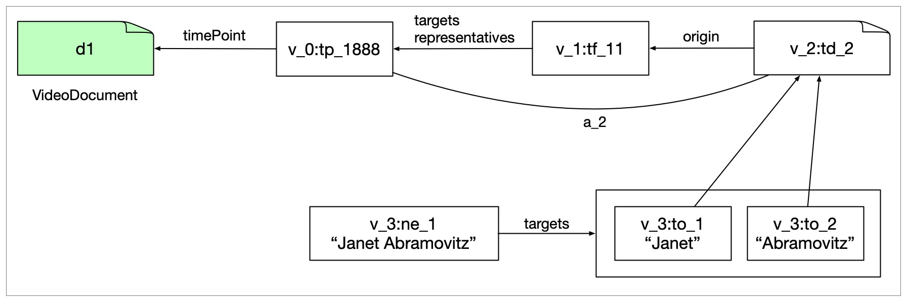

# Summarizer Notes ⎯ spaCy

[ [home](../developer-notes.md)
| [whisper](whisper.md)
| [kaldi](kaldi.md)
| [SWT-DocTR](swt-doctr.md)
| [SWT-Llava](swt-llava.md)
| [SWT-SmolVLM](swt-smolvlm.md)
| spaCy
]


### spacy-wrapper-v1.1

Example file used: cpb-aacip-507-6w96689725-transcript.mmif

> This example is for the case where spaCy operates on just the TextDocument in the sources list. See below for an example with spaCy running on TextDocuments in views with captions from SmolVLM. There should also be another one where spaCy ran over TextDocuments from Whisper.

There is one view in here with annotations of types Token, NounChunk, Sentence and NamedEntity. For the Token we have start, end, pos, lemma and text properties.

```json
{
  "@type": "http://vocab.lappsgrid.org/Token",
  "properties": {
    "start": 0,
    "end": 0,
    "pos": "NNP",
    "lemma": "ROBERT",
    "text": "ROBERT",
    "id": "to_1"
  }
}
```

NounChunks use the targets property to refer to the tokens, they also include the text.

```json
{
  "@type": "http://vocab.lappsgrid.org/NounChunk",
  "properties": {
    "targets": ["to_1", "to_2"],
    "text": "ROBERT MacNEIL",
    "category": "NP",
    "id": "nc_1"
  }
}
```

Sentences (no MMIF example here) are similar to NounChunks, with targets to Tokens and a text, but they do not have a category.

And finally the NamedEntity, simiar to the NounChunk:

```json
{
  "@type": "http://vocab.lappsgrid.org/NamedEntity",
    "properties": {
    "targets": ["to_1", "to_2"],
    "text": "ROBERT MacNEIL",
    "category": "ORG",
    "id": "ne_1"
  }
}
```

Here is how they interconnect visually:



This includes just the first three tokens of the document, the first sentence has six tokens. The arrows to the tokens are all via the targets property and the arrows to the TextDocument are via start and end properties.


### swt-detection-v7.7--smolvlm2-captioner--spacy-wrapper-v2.1

Here we have five views: an SWT view with 11 TimePoints, an SWT view with two TimeFrames and one Annotation, a SmolVLM view with two TextDocuments and two Alignments, and two views with spaCy results. The first three views are described in [SWT-SmolVLM](swt-smolvlm.md).

The two spaCy view have the same structure. Each of them connects to one of the TextDocument annotatations in the SmolVLM view. We take as an example view v_3, which has the following annotations:

- Tokens (5) with start and end properties pointing at TextDocument v\_2:td\_2, which contains the text "Janet Abramovitz\n\nWorldwatch Institute" and which uses the origin property to link to TimeFrame v\_1:tf\_11
- NounChunk (2), with targets pointing at Tokens
- Sentence (1), with targets pointing at Tokens
- NamedEntity (2), with targets pointing at Tokens

The metadata for all these categories have document property pointing at TextDocument v\_2:td\_2, but only the Tokens need this.

Here is a combined graphic for all views:


