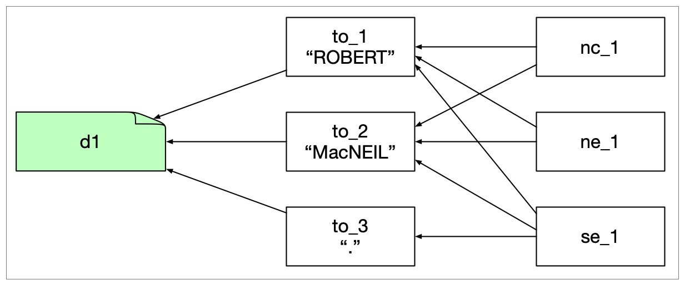

## spaCy

### spacy-wrapper-v1.1

Example file used: cpb-aacip-507-6w96689725-transcript.mmif

> This example if for the case where spaCy operates on just the TextDocument in the sources list. An example where spaCy operates on TextDocuments in views needs to be added.

There is one view in here with annotations of types Token, NounChunk, Sentence and NamedEntity. For the Token we have start, end, pos, lemma and text properties.

```json
{
  "@type": "http://vocab.lappsgrid.org/Token",
  "properties": {
    "start": 0,
    "end": 0,
    "pos": "NNP",
    "lemma": "ROBERT",
    "text": "ROBERT",
    "id": "to_1"
  }
}
```

NounChunks use the targets property to refer to the tokens, they also include the text.

```json
{
  "@type": "http://vocab.lappsgrid.org/NounChunk",
  "properties": {
    "targets": ["to_1", "to_2"],
    "text": "ROBERT MacNEIL",
    "category": "NP",
    "id": "nc_1"
  }
}
```

Sentences (no MMIF example here) are similar to NounChunks, with targets to Tokens and a text, but they do not have a category.

And finally the NamedEntity, simiar to the NounChunk:

```json
{
  "@type": "http://vocab.lappsgrid.org/NamedEntity",
    "properties": {
    "targets": ["to_1", "to_2"],
    "text": "ROBERT MacNEIL",
    "category": "ORG",
    "id": "ne_1"
  }
}
```

Here is how they interconnect visually:



This includes just the first three tokens of the document, the first sentence has six tokens. The arrows to the tokens are all via the targets property and the arrows to the TextDocument are via start and end properties.