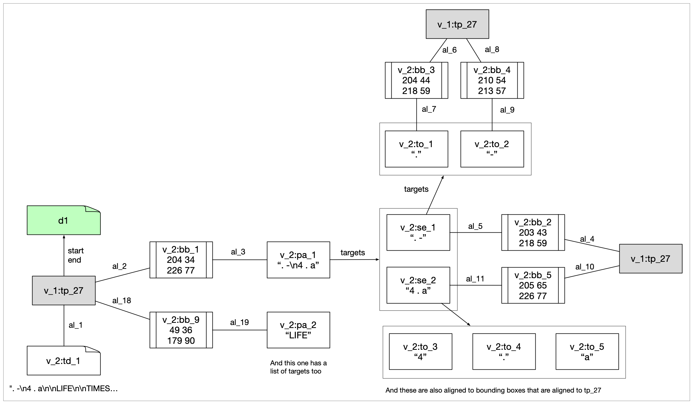

## SWT ⟹ DocTR

### swt-detection-v5.1--doctr-wrapper-v1.1

Checked with:

- cpb-aacip-526-z60bv7c69m 
- cpb-aacip-526-z892806c9c

Using this both for SWT testing and DocTR testing. Note that for SWT I would also like to test on the version that splits off the stitcher in a separate app.

### Data description

> Should perhaps farm out the part on swt5.1 to a separate swt document (and also put the swt-llava SWT thing there).

This description focuses on cpb-aacip-526-z60bv7c69m.

There are two views, one with all annotations from swt-detection-v5.1 (v_0) and one with all annotations from doctr-wrapper-v1.1.

The SWT view has the following annotations:

1. TimePoint (10) with timePoint, label and classification properties. These was manually filtered to include only timeframes before 10000 milliseconds.
2. TimeFrame (43) with label, classification, targets and representatives properties.
3. Annotation (1) with fps, frameCount and duration properties.

Notice how different this is from [swt-detection-v7.4](swt-llava.md) , which had several views for the SWT information. This is probably a good hint that in the implementation we should use some kind of datastructure that abstracts away from this.

The DocTR view is somewhat complicated. It has 48 instances of TextDocuments with just the text taken from time points that were representatives of time frames, and those TextDocuments are all aligned with that TimePoint. Paragraphs point to TextDocuments (via start and end properties) and are aligned with BoundingBoxes that themselves aligned to TimePoints. Paragraphs have targets, which are Sentences, which point to TextDocuments and are aligned to BoundigBoxes which are aligned to TimePoints. And Sentences Token targets, which point to TextDocuments and are aligned to BoundigBoxes which are aligned to TimePoints.

Below is an illustration of this for just one TextDocument in the example document. Note that the three gray boxes are all the same annotation, they are repeated to simplify the arrows.

What is not shown in the image is that all paragraphs, sentences and tokens have the document property set to td\_1. That is not always the case, there are many more Paragraphs, Sentence and Tokens that point to other TextDocuments.