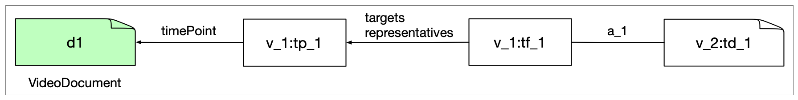

[ [developer notes](../developer-notes.md)
| [whisper](whisper.md)
| [kaldi](kaldi.md)
| [SWT-DocTR](swt-doctr.md)
| SWT-Llava
| [spaCy](spacy.md)
]


## SWT ⟹ Llava


### swt-detection-v7.4--llava-captioner-v1.2-6-gc824c97

Checked with cpb-aacip-225-12z34w2c.

Using this both for SWT/TimeFrames testing and Llava testing

The options that make the most sense here are --captions and --timeframes, although the latter may give you many more time frames then just the ones that were captioned.


### Data description

The example file has four views: 

1. An SWT view (v\_0) with the time point classification results with 30,614 TimePoints with label, classification and timePoint attributes.
2. An SWT view (v\_1) with the stitcher results with 24 TimeFrames with label, classification, targets and representatives attributes (the latter two pointing to the  TimePoints in the previous view). They also all have a timeUnit attribute set to milliseconds. It also has 1 Annotation with framecount, fps and duration.
2. An SWT view (v\_2) with a warning on frame extraction.
3. A LLava captioner view (v\_3) with 24 TextDocuments with the transcript and 24 Alignments (to TimeFrames in v_1). The alignments are really understood to be to the TimePoint that is mentioned as the representative for the TimeFrame.

Here is a graph with just one TimePoint, one TimeFrame and one added TextDocument:



For v_2:td\_1, the caption is in the text value.


### Output

For the timeframes **summary** we get the basics:

```json
{
  "identifier": "v_1:tf_1",
  "label": "chyron",
  "score": 0.40812081484390156,
  "start-time": 34134,
  "end-time": 39273,
  "representatives": [ 38405 ]
}
```
     
For the captions **summary** we grab the time point of the representative and the text:

```json
{
  "identifier": "v_3:td_1",
  "time-point": 38405,
  "text": "\nCHARLES STUBBLEFIELD HAWAII PUNL!"
}
```
