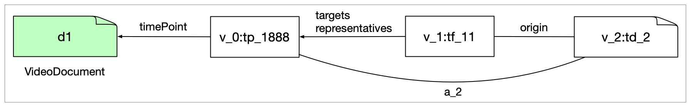

[ [developer notes](../developer-notes.md)
| [whisper](whisper.md)
| [kaldi](kaldi.md)
| [SWT-DocTR](swt-doctr.md)
| [SWT-Llava](swt-llava.md)
| SWT-SmolVLM
| [spaCy](spacy.md)
]


## SWT ⟹ SmolVLM

This is very similar to [SWT-Llava](swt-llava.md).


### swt-detection-v7.7--smolvlm2-captioner/

Checked with cpb-aacip-507-1v5bc3tf81.

The options that make the most sense here are --captions and --timeframes, although the latter may give you many more time frames then just the ones that were captioned.


### Data description

The example file has three views: 

1. An SWT view (v\_0) with the time point classification results with 3,720 TimePoints with label, classification and timePoint attributes.
2. An SWT view (v\_1) with the stitcher results with 13 TimeFrames with label, classification, targets and representatives attributes (the latter two pointing to the TimePoints in the previous view). It also has 1 Annotation with framecount, fps and duration. There are two differences with the same SWT view in [SWT-Llava](swt-llava.md): (1) there is no timeUnit attribute and (2) the id attribute is a full attribute.
3. A SmolVLM captioner view (v\_2) with 3 TextDocuments with the caption and 3 Alignments (to TimePoints in v_0).

The captioner view is different from [SWT-Llava](swt-llava.md) in that alignments are not to TimeFrames any more and that it has some extra features, including origin. Here is an example of a full TextDocument and an Alignment:

```json
{
  "@type": "http://mmif.clams.ai/vocabulary/TextDocument/v1",
  "properties": {
    "document": "d1",
    "origin": "v_1:tf_11",
    "provenance": "derived",
    "mime": "application/json",
    "text": {
      "@value": "Janet Abramovitz\n\nWorldwatch Institute",
      "@language": "en"
    },
    "id": "v_2:td_2"
  }
}
```
```json
{
  "@type": "http://mmif.clams.ai/vocabulary/Alignment/v1",
  "properties": {
    "source": "v_0:tp_1888",
    "target": "v_2:td_2",
    "id": "v_2:al_2"
}
```

The value of the origin attribute on the document is the identifier of the time frame that has the aligned time point as its representative.

Here is a depiction in graph format, with just one TimePoint, one TimeFrame and one added TextDocument:


