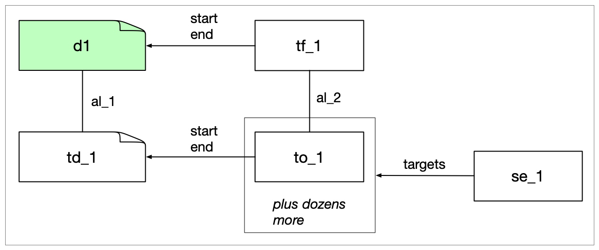

[ [developer notes](../developer-notes.md)
| whisper
| [kaldi](kaldi.md)
| [SWT-DocTR](swt-doctr.md)
| [SWT-Llava](swt-llava.md)
| [spaCy](spacy.md)
]

## Whisper Pipeline

The current canonical pipeline is **whisper-wrapper/v8**.

Full list of pipelines:

- whisper-wrapper/v3
- whisper-wrapper/v6-3-ge33e60f
- whisper-wrapper/v7
- whisper-wrapper/v8
- whisper-wrapper/v8-3-g737e280


### Data Description

For whisper-wrapper/v8.

Checked this on cpb-aacip-507-154dn40c26.

Contains one VideoDocument d1 in the documents list and two views. One view (v\_1) has user warnings and the other (v\_0) has instances of TextDocument, Token, Sentence, TimeFrame and Alignment.

- TextDocument (1). The identifier is v\_0:td\_1. Aligned with the VideoDocument d1.
- Token (9,375). All aligned with TimeFrames. They all have start and end properties and the local document property always refers to v\_0:td\_1
- Sentence (549). Not aligned. Have a text property and a list of targets, but no start and end.
- TimeFrame (9,375). With frameType (always "speech"), start and end properties.
- Alignment (9,376).

Here is a fragment in graph form. In all graphs, the document from the sources list is in green, alignments are straight lines and anchorings via start/end/targets properties are arrows.
 



### Output

For the summary we get all the Sentences with their start and end timepoints and some other goodies.

```json
{
  "start-time": 110860,
  "end-time": 113560,
  "duration": 2700,
  "length": 48,
  "text": "South Africa's currency, The Rant, fell sharply."
}
```

Problem: the Sentences are not Sentences, instead, they are semi-random Spans that cut through sentence boundaries with abandon. Here are the first 10 sentences from the example file (well, skipping the first which was a long sequence of beeps):

```
 667  702  beep, beep, beep, beep, beep, beep.
 703  708  Sound
 709  754  Good evening. Here are the top news headlines
 755  854  today. Moscow threatened to deploy anti-satellite weapons in space. The farm credit administration,
 855  949  the biggest farm lender, said it needs financial help. South Africa's currency, The Rant, fell
 950 1037  sharply. Delta Airlines is suing the FAA for negligence in the Dallas crash that killed
1038 1128  to 135 people. More details of these stories in a moment. Jim Lehrer is away tonight. Judy
1129 1161  Woodruff is in Washington. Judy?
1162 1248  We focus most of the news hour tonight on AIDS, the disease that is fast becoming this
```

Note that there is no real sentence structure, but there are still punctuation characters to work with if we chose to.

