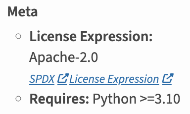

# Publishing the summarizer

Notes on how to publish the summarizer as a PyPI package. Adding more details compared to the module readme file.


## Starting point

We start with a Python code package in `code/summarizer`:

```
code/summarizer/
├── __init__.py
├── config.py
├── graph.py
├── README.md
├── summary.py
├── summary2html.py
└── utils.py
```

For now we have a flat layout, but it may be a good idea to go to a src layout. See [this discussion](https://packaging.python.org/en/latest/discussions/src-layout-vs-flat-layout/).

For now we also do this in a clean virtual environment with standard Python tools, in particular `build` and `twine`:

```bash
$ pip install build==1.3.0 twine==6.2.0
```

With older twine versions you can get into errors where the package has a too recent metadata version. This can also happen if you have an older system installation and you use a build environment without twine (sounds far-fetched but eactly that happened to me).

We may move to using `uv build` and `uv publish`, but the potential interactions with the non-uv Python and Pip environment are too confusing to me at the moment.


## The TOML File

Aka the project file aka `pyproject.toml`. This is the only configuration file we need.

**Project data**. 

This is mostly boiler plate, but notice that for the name I could not use 'summarizer' because that was already taken.

```toml
[project]
name = "summarizer-mv"
version = "0.1.0"
description = "MMIF Summarizer"
readme = "summarizer/README.md"
requires-python = ">=3.10"
dependencies = [
    "clams-python>=1.3.3",
]
license = " Apache-2.0"
license-files = ["LICEN[CS]E*"]
```

**Project scripts**

We want to have access to shell scripts named `summarize` and `create-html`.

```toml
[project.scripts]
summarize = "summarizer:create_summary"
create-html = "summarizer:create_html"
```

**The build system**

I am trying to use hatchling for the back end, which so far seems to work fine.

```toml
[build-system]
requires = ["hatchling >= 1.26"]
build-backend = "hatchling.build"
```

But may have to revert to setuptools (however, note how the version below is ahead of the one loaded into the virtual environment via build==1.3.0, which was 63.2.0). 

```toml
[build-system]
requires = ["setuptools >= 77.0.3"]
build-backend = "setuptools.build_meta"
```

**Finding the package code**

The above works for creating `dist/summarizer_mv-0.1.0.tar.gz`, but it chokes on creating the Wheel archive, for that you need to tell the hatch tool where to find its target:

```toml
[tool.hatch.build.targets.wheel]
packages = ["summarizer"]
```


## Building and using the build locally

Now you can build

```bash
(build) [11:41:00] code (develop) > python -m build
* Creating isolated environment: venv+pip...
* Installing packages in isolated environment:
  - hatchling >= 1.26
* Getting build dependencies for sdist...
* Building sdist...
* Building wheel from sdist
* Creating isolated environment: venv+pip...
* Installing packages in isolated environment:
  - hatchling >= 1.26
* Getting build dependencies for wheel...
* Building wheel...
Successfully built summarizer_mv-0.1.0.tar.gz and summarizer_mv-0.1.0-py3-none-any.whl
```

To use this code locally from scratch you take four steps: (1) create a directory, I created `use-summarizer` at the top level of this repository), (2) cd into the new directory, create a clean virtual environment and activate it, (3) install the distribution and (4) try it.

```bash
$ mkdir run-summarizer
$ cd run-summarizer
$ python3 -m venv .venv
$ source .venv/bin/activate
$ pip install ../code/dist/summarizer_mv-0.1.0-py3-none-any.whl
$ summarize
```

The last step, since it does not give any of the needed command line arguments, should print a help message.


## Publishing

Use the twine module to upload to TestPyPI:

```bash
$ twine upload --repository testpypi dist/*
```

If this succeeds there should be a new upload at [https://test.pypi.org/project/summarizer-mv/](https://test.pypi.org/project/summarizer-mv/). Plenty can go wrong of course, including forgetting to increase the version number. But if it didn't you can cut and paste the pip-install command and use it in another clean directory.

```bash
$ mkdir use-summarizer2
$ cd use-summarizer2/
$ python
$ python3 -m venv .venv
$ source .venv/bin/activate
$ pip install -i https://test.pypi.org/simple/ summarizer-mv
```

The latter gave a ludicrous error:

```
Looking in indexes: https://test.pypi.org/simple/
Collecting summarizer-mv
  Downloading https://test-files.pythonhosted.org/packages/04/fc/41a4b90ed0bf42d70f938813aef1c3815726383db9df1b2208d0670c613d/summarizer_mv-0.2.0-py3-none-any.whl (22 kB)
  Downloading https://test-files.pythonhosted.org/packages/79/8d/0cddc1d2d30d145f74d75b2ce32bf3bd3b6e05b8e65cc0795839d2ca0346/summarizer_mv-0.1.0-py3-none-any.whl (22 kB)
ERROR: Cannot install summarizer-mv==0.1.0 and summarizer-mv==0.2.0 because these package versions have conflicting dependencies.

The conflict is caused by:
    summarizer-mv 0.2.0 depends on clams-python>=1.3.3
    summarizer-mv 0.1.0 depends on clams-python>=1.3.3

To fix this you could try to:
1. loosen the range of package versions you've specified
2. remove package versions to allow pip attempt to solve the dependency conflict

ERROR: ResolutionImpossible: for help visit https://pip.pypa.io/en/latest/topics/dependency-resolution/#dealing-with-dependency-conflicts
```

Why would it try to install both?

So trying this

```bash
$ pip install -i https://test.pypi.org/simple/ summarizer-mv==0.2.0
```

Which also failed

```
Looking in indexes: https://test.pypi.org/simple/
Collecting summarizer-mv==0.2.0
  Using cached https://test-files.pythonhosted.org/packages/04/fc/41a4b90ed0bf42d70f938813aef1c3815726383db9df1b2208d0670c613d/summarizer_mv-0.2.0-py3-none-any.whl (22 kB)
ERROR: Could not find a version that satisfies the requirement clams-python>=1.3.3 (from summarizer-mv) (from versions: 0.0.1a1.macosx-10.7-x86_64, 0.0.1, 0.0.2, 0.3.0)
ERROR: No matching distribution found for clams-python>=1.3.3
```

The reason for this is that pip tries to download everything from [https://test.pypi.org/simple/](https://test.pypi.org/simple/), but that repository does not have clams-python==1.3.3. So instead you need to do:

```bash
$ python3 -m pip install --index-url https://test.pypi.org/simple/ --extra-index-url https://pypi.org/simple/ summarizer-mv
```

And now you can do

```bash
$ summarize
```

And again this should give you a help message.


## Improvements


### Creating a smaller build

The first problem is that the `dist/summarizer_mv-0.1.0.tar.gz` is very big because it pulled in everything including a bunch of MMIF files that were not even under git control. That should not have happened as far as I can see, but let's roll with it untill I figure out why that is happening. Note that this was not the case for the Wheel archive.

One change could be to use the src layout, but I also want to see whether project file tweaks could help. There are hints that at least with the setuptools back end you can use the MANIFEST.in file, but that did not work for me.

> I tried it with the hatchling back end, should also try it with the setuptools back end.

For hatchling you can add the following to `pyproject.py`:

```toml
[tool.hatch.build.targets.sdist]
exclude = [
  "/examples",
  "/scripts",
  "mmif-storage.*.txt",
]
```

I found the above at [https://hatch.pypa.io/1.9/build/](https://hatch.pypa.io/1.9/build/). I do not know whether there are options to include files as well.


### Fixing the license

With the above configuration you do not get a nice license printed on the PyPI site, basically all you get is this:



The SPDX link is pretty useless and I do not like that it says "License Expression" instead of just "License". Sadly, it looks like what I get is actually intentional (see [https://hugovk.dev/blog/2025/improving-licence-metadata/](https://hugovk.dev/blog/2025/improving-licence-metadata/)). And the  [SPDX link](https://spdx.org/licenses/) actually leads to a list of all licenses.

We could still use a classifier:

```toml
classifiers = [
    "License :: OSI Approved :: MIT License"]
```

But that way is now deprecated.


### Adding images to the description

I tried this by adding an image at the same level as the description file and link to it from the description file. The problem is that this cannot be relative link. So instead save the image somewhere else in the repo (not in the package code) so it does not clog up the package and then link to it with an absolute path

```

```

To get the image's raw link on GitHub, right-click the image and choose Copy image address. 

See [https://glasnt.com/blog/new-images/](https://glasnt.com/blog/new-images/) and [how-do-i-add-images-to-a-pypi-readme-that-works-on-github](https://stackoverflow.com/questions/41983209/how-do-i-add-images-to-a-pypi-readme-that-works-on-github) on stackoverflow.


### Quicker testing with uv

Since uv loads modules so much faster it could be worth doing this. In short:

```bash
$ uv init --python 3.10 use-summarizer
$ cd use-summarizer
$ uv add --default-index https://test.pypi.org/simple/ --index https://pypi.org/simple/ summarizer-mv==0.2.0
$ uv run summarize
```

And after an update of your package on TestPyPI:

```bash
$ uv add --reinstall --default-index https://test.pypi.org/simple/ --index https://pypi.org/simple/ summarizer-mv==0.2.0
$ uv run summarize
```

The rest of this section give a more verbose elaboration of the above.

After you set up your project (going for 3.10 since that is still the CLAMS default), you have a project file with just some project metadata: name, version, description, readme, requires-python and an empty dependencies list.

Now add the module. You could do this with settings in the project file where you can specify a local file or a web location:

```toml
[tool.uv.sources]
hello_world = { path = "../hello-world/dist/hello_world-0.1.0-py3-none-any.whl" }
```

But these settings disappear after removing the module. Instead you can do it from the command line:

```bash
$ uv add --default-index https://test.pypi.org/simple/ --index https://pypi.org/simple/ summarizer-mv==0.2.0
```

This will add summarizer-mv==0.2.0 to the list of dependencies and the following instructions to the uv tool:

```toml
[[tool.uv.index]]
url = "https://pypi.org/simple/"

[[tool.uv.index]]
url = "https://test.pypi.org/simple/"
default = true
```

And now we can run the summarizer:

```bash
$ uv run summarize
```
