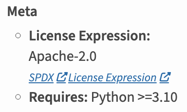

# Publishing the Inspector

Verbose notes on how to publish the inspector as a PyPI package. Adding more details compared to the module readme file.


## Starting point

We start with a Python code package in `code/inspector`:

```
code/inspector/
├── __init__.py
├── config.py
├── inspect.py
├── main.css
├── main.js
└── utils.py
```

For now we have a flat layout, but it may be a good idea to go to a src layout. See [this discussion](https://packaging.python.org/en/latest/discussions/src-layout-vs-flat-layout/).

These notes assume a clean virtual environment with standard Python tools, in particular `build` and `twine`:

```bash
$ pip install build==1.3.0 twine==6.2.0
```

With older twine versions you can get into errors where the package has a metadata version that is  too recent. This can also happen if you have an older system installation and you use a build environment without twine (sounds far-fetched but exactly that happened to me).

Alternatives to the below are `uv build` and `uv publish`, but for now these notes stick to the barebones pip-only approach.


## The TOML File

Aka the project file aka `pyproject.toml`. This is the only configuration file we need.

**Project data**. 

Mostly boiler plate, but notice that for the name I could not use 'inspector' because that was already taken. May want to use mmif-inspector instead, which as of January 2026 was available.

```toml
[project]
name = "inspector-mv"
version = "0.0.4"
description = "MMIF Inspector"
readme = "inspector/README.md"
requires-python = ">=3.10"
dependencies = [
    "jinja2>=3.1.6",
]
license = "Apache-2.0"
license-files = ["LICENSE"]
```

**Project scripts**

To have access to a shell script named `inspect` and hook it up to some specific Python code.

```toml
[project.scripts]
inspect = "inspector:main"
```

**The build system**

I am using hatchling for the back end, which so far seems to work fine. I forgot why I choose this particular backend.

```toml
[build-system]
requires = ["hatchling >= 1.26"]
build-backend = "hatchling.build"
```

In case we have to revert to setuptools:

```toml
[build-system]
requires = ["setuptools >= 77.0.3"]
build-backend = "setuptools.build_meta"
```

Note how the version above is ahead of the one loaded into the virtual environment via build==1.3.0, which was 63.2.0. 

**Finding the package code**

The above works for creating `dist/inspector_mv-0.0.4.tar.gz`, but it chokes on creating the Wheel archive, for that you need to tell the hatch tool where to find its target:

```toml
[tool.hatch.build.targets.wheel]
packages = ["inspector"]
```


## Building and using the build locally

Now you can build

```
(build) [23:52:01] (develop)> python -m build
* Creating isolated environment: venv+pip...
* Installing packages in isolated environment:
  - hatchling >= 1.26
* Getting build dependencies for sdist...
* Building sdist...
* Building wheel from sdist
* Creating isolated environment: venv+pip...
* Installing packages in isolated environment:
  - hatchling >= 1.26
* Getting build dependencies for wheel...
* Building wheel...
Successfully built inspector_mv-0.0.4.tar.gz and inspector_mv-0.0.4-py3-none-any.whl
```

To use this code locally from scratch you take four steps: (1) create a directory, (2) cd into the new directory, (2) create a clean virtual environment and activate it, (3) install the distribution and (4) try it.

```bash
$ mkdir tmp ; cd tmp
$ python3 -m venv .venv
$ source .venv/bin/activate
$ pip install ../dist/inspector_mv-0.0.4-py3-none-any.whl
$ inspect -h
```

The last step should print a help message.


## Publishing

Use the twine module to upload to TestPyPI:

```bash
$ twine upload --repository testpypi dist/*
```

If this succeeds there should be a new upload at [https://test.pypi.org/project/inspector-mv/](https://test.pypi.org/project/inspector-mv/). Plenty can go wrong, including forgetting to increase the version number in which case you try to upload something that is already uploaded. But if it didn't you can use pip-install to install the package in another environment:

```bash
$ mkdir test ; cd test
$ python3 -m venv .venv
$ source .venv/bin/activate
$ pip install -i https://test.pypi.org/simple/ inspector-mv
$ inspect -h
```

If the package depends on other packages in the test PyPI repository then you need to add the  --extra-index-url option:

```bash
$ python3 -m pip install --index-url https://test.pypi.org/simple/ --extra-index-url https://pypi.org/simple/ inspector-mv
```

### Some old weird problem.

Feel very free to skip this, partially because ome of the prose below may be only for the time when we had a full summarizer, also, the inspector package does not depend on clams-python.

Anyway, with 

```bash
$ pip install -i https://test.pypi.org/simple/ inspector-mv
```

there used to be the following error:

```
Looking in indexes: https://test.pypi.org/simple/
Collecting summarizer-mv
  Downloading https://test-files.pythonhosted.org/packages/04/fc/41a4b90ed0bf42d70f938813aef1c3815726383db9df1b2208d0670c613d/summarizer_mv-0.2.0-py3-none-any.whl (22 kB)
  Downloading https://test-files.pythonhosted.org/packages/79/8d/0cddc1d2d30d145f74d75b2ce32bf3bd3b6e05b8e65cc0795839d2ca0346/summarizer_mv-0.1.0-py3-none-any.whl (22 kB)
ERROR: Cannot install summarizer-mv==0.1.0 and summarizer-mv==0.2.0 because these package versions have conflicting dependencies.

The conflict is caused by:
    summarizer-mv 0.2.0 depends on clams-python>=1.3.3
    summarizer-mv 0.1.0 depends on clams-python>=1.3.3

To fix this you could try to:
1. loosen the range of package versions you've specified
2. remove package versions to allow pip attempt to solve the dependency conflict

ERROR: ResolutionImpossible: for help visit https://pip.pypa.io/en/latest/topics/dependency-resolution/#dealing-with-dependency-conflicts
```

Why would it try to install both?

The following also failed:

```bash
$ pip install -i https://test.pypi.org/simple/ summarizer-mv==0.2.0
```
```
Looking in indexes: https://test.pypi.org/simple/
Collecting summarizer-mv==0.2.0
  Using cached https://test-files.pythonhosted.org/packages/04/fc/41a4b90ed0bf42d70f938813aef1c3815726383db9df1b2208d0670c613d/inspector_mv-0.2.0-py3-none-any.whl (22 kB)
ERROR: Could not find a version that satisfies the requirement clams-python>=1.3.3 (from summarizer-mv) (from versions: 0.0.1a1.macosx-10.7-x86_64, 0.0.1, 0.0.2, 0.3.0)
ERROR: No matching distribution found for clams-python>=1.3.3
```

The reason for this is that pip tries to download everything from [https://test.pypi.org/simple/](https://test.pypi.org/simple/), but that repository does not have clams-python==1.3.3. So instead you need to use the --extra-index-url option, as shown above.
And again this should give you a help message.


## Improvements


### Creating a smaller build

The first potential problem is that the created archive can be very big because it pulled in everything in the package repository even things under git control. That should not have happened as far as I can see, but let's roll with it untill I figure out why that is happening. Note that this was not the case for the Wheel archive.

One change could be to use the src layout, but I also want to see whether project file tweaks could help. There are hints that at least with the setuptools back end you can use the MANIFEST.in file, but that did not work for me.

> I tried it with the hatchling back end, should also try it with the setuptools back end.

For hatchling you can add the following to `pyproject.py` (see [https://hatch.pypa.io/1.9/build/](https://hatch.pypa.io/1.9/build/)):

```toml
[tool.hatch.build.targets.sdist]
exclude = ["/scripts", "/out"]
```

Or instead just do this:

```toml
[tool.hatch.build.targets.sdist]
only-include = ["inspector", "pyproject.toml"]
```


### Fixing the license

With the above configuration you do not get a nice license printed on the PyPI site, basically all you get is this:



The SPDX link is pretty useless and I do not like that it says "License Expression" instead of just "License". Sadly, it looks like that is all intentional (see [https://hugovk.dev/blog/2025/improving-licence-metadata/](https://hugovk.dev/blog/2025/improving-licence-metadata/)). And the  [SPDX link](https://spdx.org/licenses/) actually leads to a list of all licenses.

We could still use a classifier:

```toml
classifiers = [
    "License :: OSI Approved :: MIT License"]
```

But that way is now deprecated.


### Adding images to the description

> Note, the links below are for the old summarizer
 
I tried this by adding an image at the same level as the description file and link to it from the description file. The problem is that this cannot be relative link. So instead save the image somewhere else in the repo (not in the package code so it does not clog up the package) and then link to it with an absolute path. To get the image's raw link on GitHub, right-click the image and choose "Copy image address". See [https://glasnt.com/blog/new-images/](https://glasnt.com/blog/new-images/) and [how-do-i-add-images-to-a-pypi-readme-that-works-on-github](https://stackoverflow.com/questions/41983209/how-do-i-add-images-to-a-pypi-readme-that-works-on-github) on stackoverflow.

The right-clicking does not work really, but here is the general recipe for the image name:

```
https://raw.githubusercontent.com/<github_username>/<repository_name>/<branch_name>/<image_name>
```

For example de URL [https://raw.githubusercontent.com/clamsproject/mmif-summarizer/main/docs/output/page-timeframes.png](https://raw.githubusercontent.com/clamsproject/mmif-summarizer/main/docs/output/page-timeframes.png) is used for the image below.


### Quicker testing with uv

Since uv loads modules so much faster it could be worth doing this. In short:

```bash
$ uv init --python 3.10 tmp ; cd tmp
$ uv add --default-index https://test.pypi.org/simple/ --index https://pypi.org/simple/ inspector-mv==0.0.4
$ uv run inspect -h
```

And after an update of your package on TestPyPI:

```bash
$ uv add --reinstall --default-index https://test.pypi.org/simple/ --index https://pypi.org/simple/ inspector-mv==0.0.5
$ uv run inspect -h
```

The rest of this section elaborates on the above.

After you set up your project (going for 3.10 since that is still the CLAMS default), you have a project file with just some project metadata: name, version, description, readme, requires-python and an empty dependencies list.

Now add the module. You could do this with settings in the project file where you can specify a local file or a web location:

```toml
[tool.uv.sources]
hello_world = { path = "../hello-world/dist/hello_world-0.1.0-py3-none-any.whl" }
```

But these settings disappear after removing the module. Instead you can do it from the command line:

```bash
$ uv add --default-index https://test.pypi.org/simple/ --index https://pypi.org/simple/ inspector-mv==0.0.4
```

This will add inspector-mv==0.0.4 to the list of dependencies and the following instructions to the uv tool:

```toml
[[tool.uv.index]]
url = "https://pypi.org/simple/"

[[tool.uv.index]]
url = "https://test.pypi.org/simple/"
default = true
```

And now we can run the package:

```bash
$ uv run inspect -h
```
